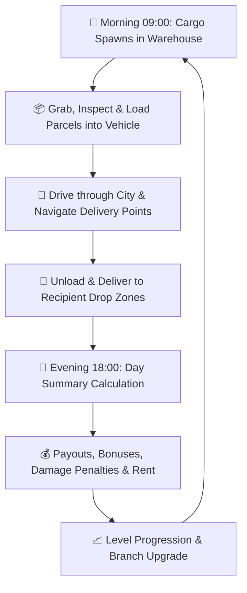

# 🚚 Courier Simulator (Unity 6 Physics-Based Delivery Prototype)

[-blue.svg?logo=unity)](https://unity.com/)
[-purple.svg)](https://unity.com/srp/Universal-Render-Pipeline)
[](https://docs.unity3d.com/Packages/com.unity.inputsystem@latest)
[](https://docs.microsoft.com/en-us/dotnet/csharp/)
[]()

> A first-person physics-driven cargo delivery and logistics simulation built from scratch in **Unity 6**. Features custom Ackermann-based vehicle physics, physics-driven parcel manipulation, dynamic day/night economy cycles, branch progression, and custom Unity Editor productivity tools.

---

## 🎬 Gameplay Showcase & Video

[](https://www.youtube.com/watch?v=aomwd1GVv_w)

> 💡 **Click the badge or image below to watch the full gameplay overview:**

[](https://www.youtube.com/watch?v=aomwd1GVv_w)

---

## 📸 Screenshots & Highlights

| 🚗 Vehicle Cockpit & Free-Look | 📦 Warehouse & Package Physics |
| :---: | :---: |
|  |  |
| *First-person dashboard camera with smooth free-look & mirror visibility* | *Dynamic package spawning with physical charge-throw mechanics* |

| 🗺️ Delivery Route & Address System | 📊 Daily Financial Ledger & Summary |
| :---: | :---: |
|  |  |
| *Procedural address generation with physical drop-off zones* | *End-of-day revenue, early delivery bonus, fragile penalties & rent breakdown* |

---

## 🎮 Core Game Loop



1. **Morning Warehouse Loading:** Dynamic parcels generate based on branch level and unlocked zones. Parcels feature real-time 3D localized labels.
2. **Physics Handling & Loading:** Grab packages using physics-based handling (`[E]`), check fragile/express statuses, or charge throw (`Hold E / Left Click`) into the vehicle bed.
3. **Driving & Navigation:** Drive through suburban streets using custom Ackermann-steering vehicle physics, manage fuel, open/close tailgates, and toggle between cockpit free-look and 3rd-person chase cameras.
4. **Delivery Execution:** Drop parcels in client delivery zones before deadlines to earn early delivery bonuses.
5. **Day-End Accounting:** Review total daily revenue, early delivery multipliers, fragile mishandling fees, missed delivery fines, and branch rent deductions.
6. **Progression & Expansion:** Spend earned profits on warehouse upgrades, new delivery vehicles, and higher-tier delivery zones.

---

## ⚡ Key Technical Features & Mechanics

### 1. 🚗 Custom Vehicle Physics & Driving System (`CarController.cs`)
- **Ackermann Differential Steering:** Realistic wheel turning geometry (40° inner wheel, 32° outer wheel) preventing tire scrubbing and providing intuitive cornering.
- **AWD Torque Distribution (35% Front / 65% Rear):** Balanced acceleration curve offering responsive low-speed climbing and high-speed stability.
- **Dynamic Turn Torque Assist:** Augmented angular impulse for sharp, tight suburban turns and maneuvering.
- **Smooth Dual Camera System:**
  - **Cockpit Mode:** First-person driver seat with ±110° free-look mouse control to check dashboard gauges and side mirrors.
  - **Chase Mode (`[V]`):** Smooth Lerp-damped third-person external camera.
- **Interactive Vehicle Features:** Gas station refuel pump system (`FuelStationPump.cs`), interactive animated tailgates (`VehicleTailgate.cs`), and vehicle showroom unlocking (`VehicleShowroomManager.cs`).

### 2. 🖐️ Physics-Based Cargo Manipulation (`PhysicsGrabber.cs`)
- **De-Jitter & Self-Collision Elimination:** Dynamic collision masking with the player capsule (`CharacterController`) prevents camera shaking and jitter when holding bulky objects.
- **Automatic Face-to-Camera Alignment:** Packages held in hand automatically rotate their label surface `(-60°, 0°, 0°)` toward player eye level for instant readability.
- **Charged Throwing Mechanic:** Instant tap gently drops the package; holding the throw button charges a physics impulse trajectory for launching boxes into the truck bed.
- **Dynamic 3D Package Rendering (`PhysicalCargoPackage.cs`):** Real-time TextMeshPro label generation with word-wrapping, automatic sizing, and ellipsis truncation for long recipient names.

### 3. 📦 Parcel Classification & Risk-Reward
| Cargo Category | Label Indicator | Payout Multiplier | Gameplay Modifier |
| :--- | :--- | :--- | :--- |
| **Standard** | Clean White Label | `1.0x $` / `1.0x XP` | Baseline delivery requirements |
| **Fragile** | High-Vis Orange `[FRAGILE]` | `1.5x $` / `1.4x XP` | Takes damage on impacts $> 6.5 \text{ m/s}$; broken parcels incur hefty penalties |
| **Express** | Rapid Blue `[EXPRESS]` | `1.8x $` / `1.6x XP` | Delivery before 13:00 grants a `+40%` early speed bonus |

### 4. 📈 Branch Economy & Progression (`PlayerProgressionManager.cs`)
- **Warehouse Tiers:**
  - *Tier 1:* 4 Daily Parcels ($50 Daily Rent)
  - *Tier 2:* 7 Daily Parcels ($120 Daily Rent)
  - *Tier 3:* 12 Daily Parcels ($280 Daily Rent)
  - *Tier 4:* 18 Daily Parcels ($550 Daily Rent)
- **Comprehensive Daily Ledger (`DaySummaryManager.cs`):** Itemized breakdown of base delivery earnings, speed bonuses, damaged cargo fees, lost package penalties, and operating rent.

### 5. 🛠️ Custom Unity Editor Tooling (`Tools ➔ Delivery Game`)
- **`VehicleSetupHelper`:** One-click utility that inspects raw 3D car meshes and automatically attaches `WheelCollider` pairs, seat anchors, physics rigidbodies, center-of-mass offsets, and vehicle controllers.
- **`SplineRoadBuilder` & `SimpleRoadBuilder`:** In-editor procedural road mesh generation along customizable spline paths.
- **`DeliveryUIBuilder`:** Automated Canvas instantiation for the digital delivery tablet, crosshair HUD, prompt badges, and day-summary modals.
- **`AddressLocalizationEditor`:** Procedural street and recipient database generator.

---

## ⌨️ Controls

| Action | Keyboard / Mouse Input |
| :--- | :--- |
| **Move / Walk** | `W` `A` `S` `D` |
| **Look / Aim** | `Mouse Delta` |
| **Sprint / Jump** | `Left Shift` / `Space` |
| **Interact / Pick Up / Drop** | `E` or `Left Mouse Button` |
| **Charged Throw** | `Hold E` or `Hold Left Mouse Button` (Release to throw) |
| **Enter / Exit Vehicle** | `F` |
| **Drive Vehicle** | `W` (Accelerate), `S` (Brake/Reverse), `A`/`D` (Steer) |
| **Handbrake** | `Space` |
| **Switch Camera Mode** | `V` (Cockpit Free-Look ⟷ Third-Person Chase) |
| **Cockpit Free Look** | `Mouse Movement` (while driving) |
| **Fast Forward to Day End** | `F8` (Debug / Skip) |

---

## 🏗️ Architecture & Project Structure

```
Assets/_Project/
├── Scripts/
│   ├── Vehicle/         # CarController, DrivableVehicle, FuelStationPump, VehicleTailgate
│   ├── Player/          # FPSPlayerController, PhysicsGrabber
│   ├── Delivery/        # PhysicalCargoPackage, CargoWarehouseGenerator, DaySummaryManager, DeliveryPoint
│   ├── Branch/          # BranchManager, BranchData, BranchUpgradeTerminal
│   ├── UI/              # InteractionPromptHUD, CargoTabletUI, MainHUDController
│   ├── Camera/          # SmoothFollowCamera
│   ├── Localization/    # AddressLocalizationManager
│   └── Editor/          # VehicleSetupHelper, SplineRoadBuilderEditor, MapSetupTool, AddressLocalizationEditor
├── Prefabs/             # Vehicles, Packages, Delivery Stations, UI Canvas
├── Materials/           # URP Shaders & Physical Materials
└── Scenes/              # Prototype Demo Scenes & Test Tracks
```

---

## 🚀 Getting Started / Setup

### Prerequisites
- **Unity Engine:** `Unity 6 (6000.0.x or later)`
- **Render Pipeline:** Universal Render Pipeline (`com.unity.render-pipelines.universal`)
- **Input System:** Unity New Input System (`com.unity.inputsystem`)
- **Text Rendering:** TextMeshPro (`com.unity.ugui`)

### Installation
1. Clone the repository:
   ```bash
   git clone https://github.com/HARUNLUK/Unity-Delivery-Project.git
   ```
2. Open **Unity Hub** and select **Add project from disk**.
3. Choose the `Unity Car Project` directory.
4. Ensure the editor version is set to **Unity 6 (6000.5.x)** or compatible.
5. Open `Assets/_Project/Scenes/Main_Scene.unity` (or `Level_01.unity`) and press **Play**.

---

## 🗺️ Roadmap & Prototype Backlog

- [x] Physics-based vehicle driving with Ackermann geometry & AWD torque.
- [x] First-person / Third-person dynamic driving camera with cockpit free-look.
- [x] Dynamic physics grab & charge throw system with anti-jitter collision masking.
- [x] Package types (Standard, Fragile, Express) with impact damage thresholds.
- [x] Day/Night cycle, financial ledger, and branch progression system.
- [x] Custom editor setup tools for rapid vehicle and map creation.
- [ ] AI traffic vehicles & pedestrian navigation system.
- [ ] Dynamic weather conditions (Rain/Wet road friction modifiers).
- [ ] Vehicle tuning, damage system, and maintenance garage.
- [ ] Audio system integration (Engine sound pitch lerping, ambient city sounds, radio).

---

## 👤 Author & Portfolio

**Harun Serli**
- **GitHub:** [@HARUNLUK](https://github.com/HARUNLUK)
- **LinkedIn:** [linkedin.com/in/harunluk](https://www.linkedin.com/in/harunluk/)
- **Itch.io:** [harunluk.itch.io](https://harunluk.itch.io)
- **Email:** [harunserlibusiness@gmail.com](mailto:harunserlibusiness@gmail.com)

---

*Developed as a portfolio showcase demonstrating gameplay mechanics, custom physics controllers, UI systems, and Unity Editor tooling.*
